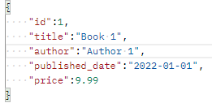

# topshelfre take home assessment

## Docker Instructions
1. Download the Docker Desktop app.
2. Create an account.
3. Clone this repository to a directory of your choice.
4. Open your terminal in this directory.
5. Run ```bash docker build -t your-build-name .``` in your terminal.
6. When that completes, run ```bash docker run -d --name your-container-name -p 80:80 your-build-name``` in your terminal.
7. Now open your Docker Desktop app and check the Containers tab.
8. Click the port number of the container with your container name.
9. Click the port number of the container with your container name to open the site in your browser.
10. You can now interact with the site through your browser, Postman, etc.
11. To start or stop the api run or stop the container in the Docker Desktop app.<br>
**Note:** The books dictionary will reset when you restart the container.


## API Instructions
The books dictionary is initially filled with 3 books occupying the first 3 ids.

### Create A Book

* URL: http://0.0.0.0:80/books
* Method: POST
* Header: Content-type: application/json; charset=utf-8
* Body: Create a JSON object using the above image as a guide<br>
**Note:** The id of your book cannot already exist in the books dictionary

### Read All Books
* URL: http://0.0.0.0:80/books
* Method: GET

### Read A Book
* URL: http://0.0.0.0:80/books/{id}
* Method: GET<br>
**Note:** The id of your book must exist in the books dictionary

### Update A Book

* URL: http://0.0.0.0:80/books/{id}
* Method: PUT
* Header: Content-type: application/json; charset=utf-8
* Body: Create a JSON object using the above image as a guide<br>
**Note:** The id of your book must already exist in the books dictionary

### Delete A Book
* URL: http://0.0.0.0:80/books/{id}
* Method: DELETE<br>
**Note:** The id of your book must already exist in the books dictionary
